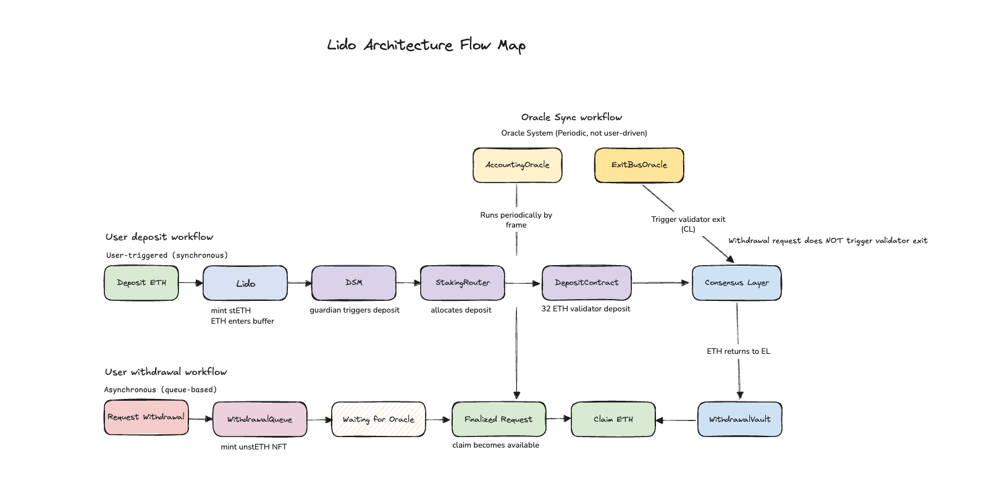

# Lido Architecture Notes

A deep dive into Lido protocol architecture, including:

- Deposit flow
- Oracle system (AccountingOracle & ExitBusOracle)
- Validator lifecycle
- Withdrawal mechanism
- Fee model

This repository explains Lido from an architectural perspective, not just code.

 

## Overview

Lido is an asynchronous, oracle-driven staking system where:

- Users deposit ETH and receive stETH
- Validators run on the Consensus Layer
- Oracle synchronizes state periodically
- Withdrawals are processed via a queue

 

## Architecture Diagram

 

## Contents

- [00 - Overview](./docs/00_lido_overview.md)
- [01 - Deposit Flow](./docs/01_deposit_flow.md)
- [02 - Module Lifecycle](./docs/02_module_lifecycle.md)
- [03 - Oracle System](./docs/03_oracle_system.md)
- [04 - AccountingOracle](./docs/04_accounting_oracle.md)
- [05 - Withdrawal Flow](./docs/05_withdrawal_flow.md)
- [06 - Fee Model](./docs/06_fee_model.md)
- [07 - ExitBusOracle](./docs/07_exit_bus_oracle.md)

 

## 💡 Key Insights

- Deposit, exit, and withdrawal are fully decoupled
- Oracle is the core driver of the system
- Withdrawal does NOT trigger validator exit
- The system is asynchronous, not user-triggered

 

## License

This work is open for learning and sharing.

David Zhang
Smart contract developer

- Email: haodongzhang125@gmail.com